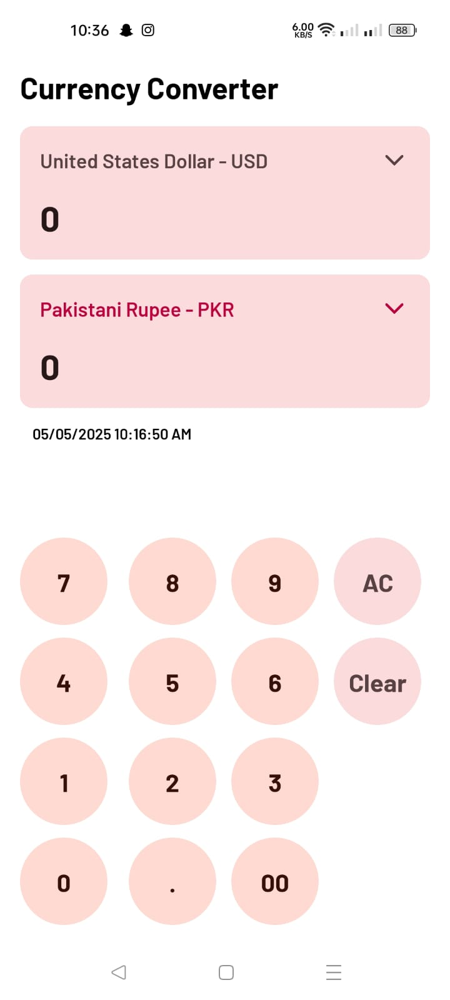
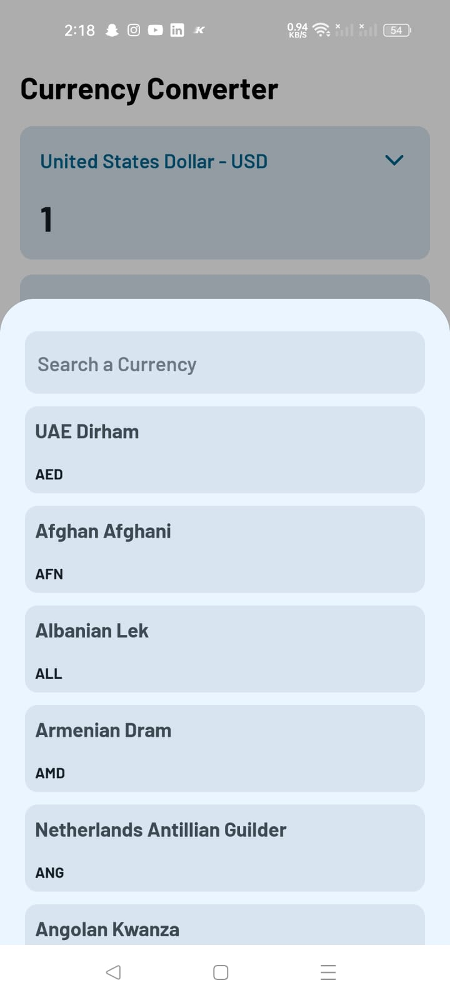

# Currency Converter – Material You Inspired

Welcome to my first Kotlin-based Android project! This app isn't just a currency converter — it's a showcase of my quick adaptability to modern tech, an eye for clean UI, and a drive to deliver user experiences that feel both intuitive and polished.

## ✨ App Highlights

### Online + Offline Support – Smart, Seamless, Reliable

Currency rates are fetched with up-to-the-hour precision (due to API limitations), ensuring users always have fairly up-to-date information. The app checks for stale data on launch and allows manual refreshing with a simple pull gesture. When offline? No problem. Thanks to RoomDB caching, previously fetched rates remain accessible, letting the app stay useful even without a connection.

### 🎨 Material You – A Personal Touch to UI

Material You is more than a trend — it's a design language that brings consistency and beauty across Android. Inspired by the dynamic aesthetics of apps like Gmail and Chrome, this app embraces pastel tones and dynamic color theming to adapt to your system’s look, whether it’s light or dark mode. The result? A harmonious, modern UI that feels right at home on any device.

### 🤝 Why This Project?

This app is my exploration of what happens when utility meets thoughtful design. It’s built on Kotlin, follows Material3 guidelines, and focuses on giving users not just a tool, but an experience — smooth, aesthetically pleasing, and just a bit delightful.

## 📱 Tech Breakdown

- **Language:** Kotlin  
- **UI & Layouts:** XML 
- **Theming:** Material You (Dynamic Colors)  
- **Architecture:** MVVM  
- **Networking:** Retrofit + Gson  
- **Local Storage:** RoomDB (for caching exchange rates)  
- **Dependency Injection:** Hilt  
- **Design Language:** Material3 + Pastel Color Palette  
- **Offline Support:** Enabled via RoomDB cache  
- **Dark/Light Theme Support:** Fully adaptive via dynamic theming

## Appreication Note

This app uses the **[Exchange Rate API](https://www.exchangerate-api.com/)** for real-time currency data.  

## Screen Captures

<table>
  <tr>
    <td></td>
    <td></td>
  </tr>
  </tr>
